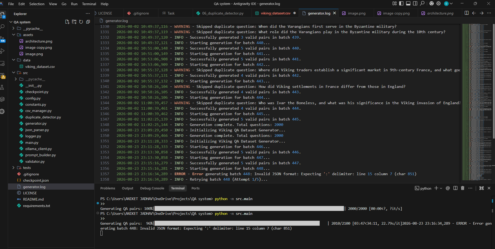

# Viking History QA Dataset Generator

## Overview
A production-grade Python application designed to automatically generate a high-quality Question-Answer dataset about Viking History using a local Ollama model. The system intelligently produces unique QA pairs, filters out duplicates, and checkpoints its progress, outputting the result directly to a CSV file.

## Features
- **Automated Generation**: Iteratively creates QA pairs based on a defined topic.
- **Duplicate Detection**: Uses RapidFuzz for fuzzy similarity detection to ensure question uniqueness.
- **Resumability**: Built-in checkpointing system to pause and resume generation seamlessly.
- **Robust Error Handling**: Configurable retry mechanisms and robust logging for API reliability.
- **Progress Tracking**: Real-time progress visualization using `tqdm`.
- **Modular Architecture**: Well-separated components for prompt building, validation, and data management.

## Architecture
Configuration → Prompt Builder → Ollama Client → JSON Parser → Validator → Duplicate Detector → CSV Manager

## Tech Stack
- **Python** (Core language)
- **Ollama** (Local LLM Server)
- **OpenAI SDK** (Client to connect to Ollama)
- **RapidFuzz** (String matching & similarity)
- **tqdm** (Progress tracking)

## Installation
1. Ensure you have [Ollama](https://ollama.ai/) installed and running locally with the required model:
   ```bash
   ollama run qwen3:8b
   ```
2. Clone the repository and navigate to the project directory.
3. Install the required Python dependencies:
   ```bash
   pip install -r 13_requirements.txt
   ```

## Usage
Run the main script to start or resume the generation process:
```bash
python -m src.main
```
The generated dataset will be iteratively saved to `viking_dataset.csv`.

## API Endpoints
*N/A - This project operates as a local CLI tool connecting to a local Ollama endpoint.*

## Results
- Successfully generates a curated, duplicate-free `viking_dataset.csv` file.
- Detailed operation logs are stored in `generator.log`.

## Screenshots
  # progress bar
  # dataset generated 2000 Q&A pairs on vikings history .

## Future Improvements
- Expand dataset domains beyond Viking History.
- Integrate additional model backends alongside Ollama.
- Add advanced QA validation algorithms.

## Author
Aniket Jadhav
